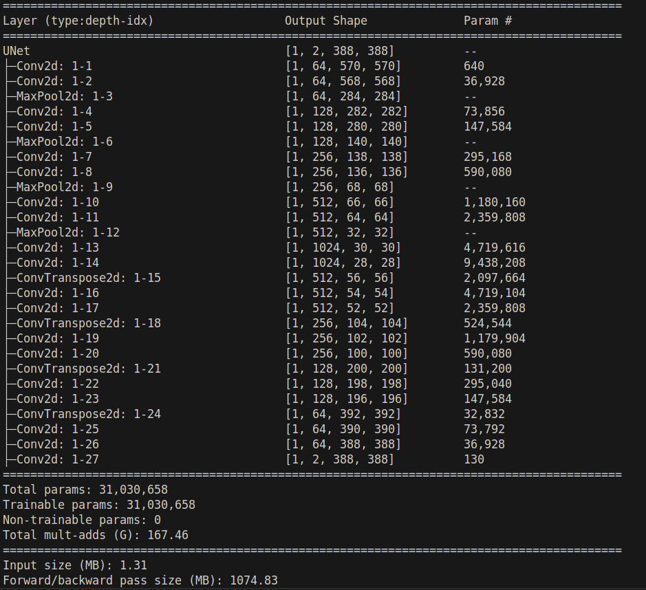

#### Deadline 31.01.2024

### Meeting 19.01.2025
- Training part: cut down the ground truth to get the training and evaluation part running --> Arthur
- Dataset mirroring of smaller images (mirroring only the train/test images (not the gt) --> Sofia
- Dataset preparation (see paper) --> Sofia
- adaptation to multiple classification (>2), optional

- keeping track of training
- table of hyperparameters (learning rate, batch size, epochs, optimizer, loss), results --> accuracy, precision, recall, f1 score)


### Architecture
- U-Net architecture is located in architecture.py



### Update 29.12.2024- Daniel
- added visualization.py: visualize the dataset and the predictions with visual comparison
- 

### Update 28.12.2024- Daniel
- found the dataset used in the paper, added it to Github

#### Update 27.12.2024- Daniel
- added architecture.py: U-Net architecture


#### Kick off 27.12.2024
- Talk about goal
- Splitting workload
- Set deadlines for milestones
- Which dataset should we use
- Set up Github

#### Tasks Daniel
- Read U-Net paper

#### Workload Split
- Providing data set, and prepare the data ⟶ Sofia
- Architecture, Visualization ⟶ Daniel
- Evaluation, Training, Setting of the hyperparameters ⟶ Arthur

#### Deadlines for Milestones
- 31.12.2024 Architecture, Visualization
- 05.01.2024 Providing data set, prepare data set
- 16.01.2024 Evaluation, Training, Setting of the hyperparameters ⟶ Arthur


#### Github
To clone the repository:
```bash
git clone https://github.com/DanielBugelnig/U-Net.git
```

Update the local repository:
```bash
git pull origin master

```

Create a new branch(one-time setup):
```bash
git checkout -b <branch-name>
```

Switch to your branch
```bash
git checkout <branch-name>
```

Commit your changes:
```bash 
git add .
git commit -m "Your message"
```
Push your changes:
```bash
git push origin <branch-name>
```
